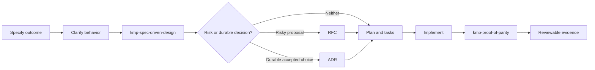

# KMP Spec-Driven Skills

Reusable agent skills for designing and verifying Kotlin Multiplatform work with explicit requirements, architecture boundaries, decision records, and evidence.

## Why this exists

AI coding agents can produce Kotlin Multiplatform code quickly. Speed is not the difficult part. The difficult part is keeping a change coherent across shared code, Android, iOS, backend contracts, failure states, and the evidence used to describe its readiness.

Without a shared workflow, agents commonly:

- start implementation before the behavior and boundaries are clear;
- place platform-independent rules in platform-specific hosts;
- introduce transport or persistence details into the domain;
- skip an RFC when a risky proposal still needs agreement;
- write an ADR before a durable decision has actually been accepted;
- run one convenient Gradle task and call the feature cross-platform;
- treat compilation, emulator testing, physical testing, store submission, and release as if they were the same claim.

These skills were extracted from the engineering practices used while building Ready Together, a Kotlin Multiplatform product with shared behavior, Android and iOS clients, a Ktor service, offline states, and safety-sensitive coordination flows. The goal is not to export private product code. It is to make the reusable reasoning process available to the KMP community.

## The problem we are trying to solve

We want humans and coding agents to collaborate on KMP features without losing three things:

1. **Intent:** the implementation remains traceable to a clear product outcome and acceptance criteria.
2. **Boundaries:** shared rules, contracts, data access, presentation, and platform integrations stay in the right place.
3. **Truthful evidence:** readiness claims match what was actually compiled, tested, observed, submitted, or released on every relevant target.

This repository provides two complementary skills:

- [`kmp-spec-driven-design`](skills/kmp-spec-driven-design/SKILL.md) turns an accepted problem into an implementation-ready KMP design, including risk classification, module ownership, contracts, degraded states, RFC/ADR decisions, and a verification plan.
- [`kmp-proof-of-parity`](skills/kmp-proof-of-parity/SKILL.md) verifies implemented behavior across the targets and evidence levels that matter, then reports what is proven and what remains open.

## Workflow



The skills do not replace product judgment, code review, or physical-device validation. They make those gates explicit and reproducible.

## Quick start

Each directory under `skills/` is self-contained. Copy or link the desired directory into the skills location supported by your coding agent, or place it in a repository-level skills directory referenced by that project's agent instructions.

Example project layout:

```text
your-kmp-project/
├── AGENTS.md
└── .agents/
    └── skills/
        ├── kmp-spec-driven-design/
        └── kmp-proof-of-parity/
```

Then ask the agent to use the relevant skill:

```text
Use kmp-spec-driven-design to turn this accepted feature spec into an
implementation-ready KMP design. Do not implement it yet.
```

```text
Use kmp-proof-of-parity to verify this change and report the highest evidence
level reached for Android, iOS, shared logic, and backend behavior.
```

The skills use the portable `SKILL.md` format documented by [Claude Agent Skills](https://docs.claude.com/en/docs/agents-and-tools/agent-skills/overview). Their KMP source-set guidance follows the [official Kotlin Multiplatform project structure](https://kotlinlang.org/docs/multiplatform/multiplatform-discover-project.html).

## Included resources

- `templates/`: lightweight specs, RFCs, ADRs, plans, tasks, verification reports, and handoffs.
- `examples/`: one routine feature and one higher-risk offline synchronization example.
- `evals/`: scenario-based expectations used to test behavior instead of exact wording.
- `scripts/validate.py`: deterministic structural, link, metadata, and secret-pattern checks.

## Evidence vocabulary

The verification skill deliberately separates:

| Status | What it means |
| --- | --- |
| `Compiled` | A relevant target compiled successfully. |
| `Automated-tested` | Relevant automated tests passed. |
| `Emulator-tested` | The intended behavior was observed on an emulator or simulator. |
| `Physically-tested` | The intended behavior was observed on the required real devices. |
| `Store-submitted` | A build was submitted to a store review process. |
| `Released` | The intended version is publicly available through the named distribution channel. |

Evidence levels are target-specific. Passing shared tests does not prove iOS runtime behavior, and an Android emulator does not prove a two-device Android-iPhone flow.

## Validate the repository

```bash
python3 scripts/validate.py
```

The validator uses only the Python standard library.

## Contributing

See [`CONTRIBUTING.md`](CONTRIBUTING.md). Improvements should be grounded in a reproducible KMP workflow, a concrete failure mode, or an evaluation case. The repository is licensed under Apache License 2.0.
Reusable agent skills for spec-driven Kotlin Multiplatform delivery and parity verification
